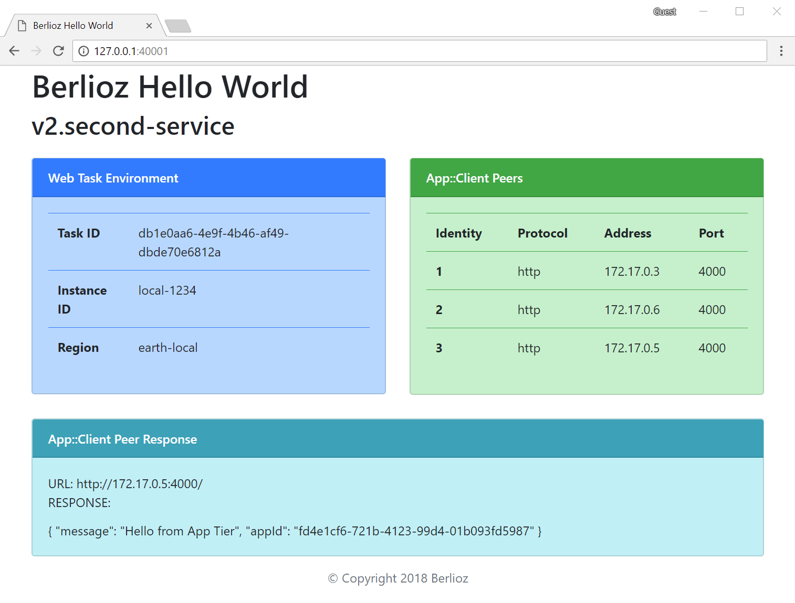
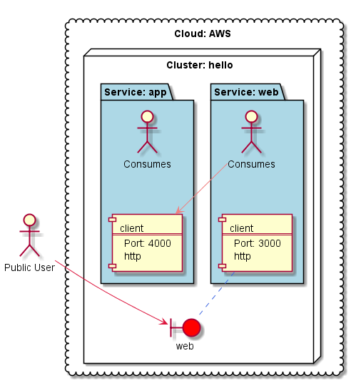

# Berlioz Hello World v2.second-service

Second version of Hello World application. The **web** service from [version one](../v1.basic) got evolved and a new **app** service got added. The **web** service communicates with the **app** service. When deployed to local workstation should look somewhat like the
screenshot below. The green box on the right shows list of **app** peers. The **web** services makes an HTTP request to a random **app** peer and outputs the response in the bottom box. This is effectively a load-balancing without any load-balancer device.



## Service Diagram
```
$ berlioz output-diagram
```


## Running Locally

1. Navigate to sample directory
```
$ cd 01.HelloWorld.js/v2.second-service
```

2. Build and deploy the project
```
$ berlioz local build-run
```

3. Output service endpoint addresses
```
$ berlioz local endpoints
```

4. Once completed release local resources
```
$ berlioz local stop
```

## Deploying to AWS

1. Make sure that AWS account is linked and deployments were created. If not follow instructions [here](../../README.md).

2. Login the region in order to push images
```
$ berlioz login
```

3. Build and push the project to berlioz
```
$ berlioz push --region us-east-1
```

4. Deploy the project to the test deployment
```
$ berlioz run --deployment test --cluster hello --region us-east-1
```

5. Check the deployment status. Proceed forward once completed.
```
$ berlioz status --region us-east-1
```

6. Output service endpoint addresses
```
$ berlioz endpoints --deployment test --region us-east-1
```

7. Once completed release AWS resources
```
$ berlioz stop --deployment test --cluster hello --region us-east-1
```

## Next Version
Navigate to [next version](../v3.load-balancer) of HelloWorld sample were a real load-balancer will be added.
