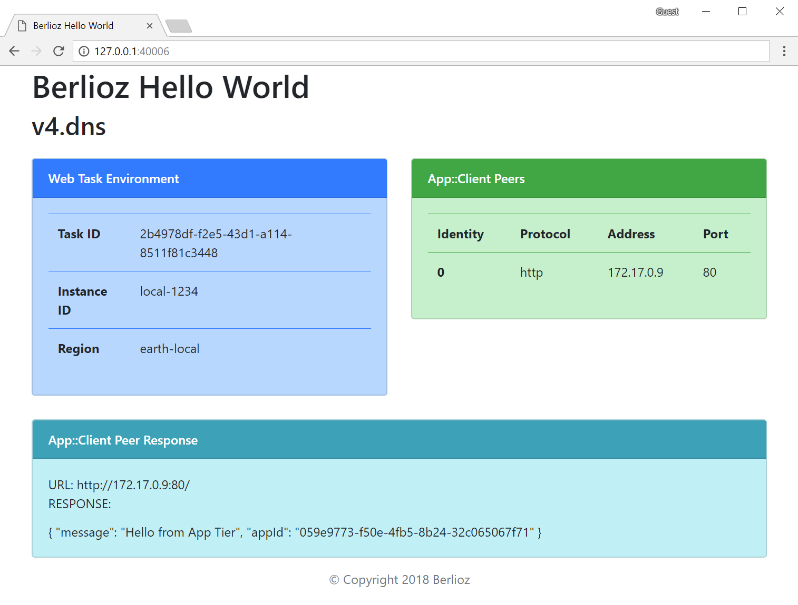
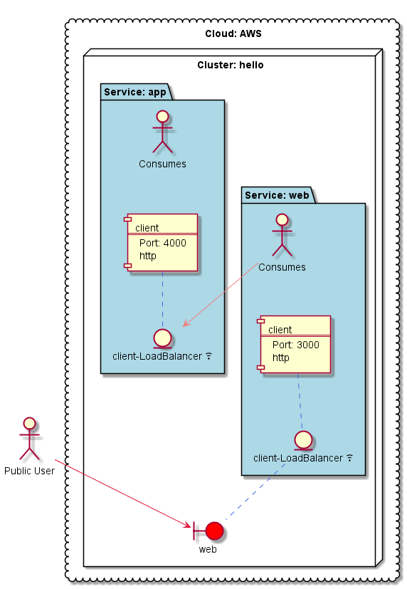
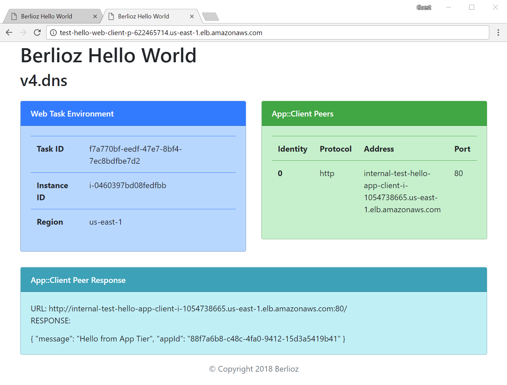

# Berlioz Hello World v4.dns

Fourth version of Hello World application. Compared with the
[third version](../v3.load-balancer) a second load-balancer is added
in front of the **app** service. Please note that there was no code change
made to the **web** service. It automatically communicates with the load-balancer
instead. Another change is to register public DNS entry for the **web** service.



## Service Diagram
```
$ berlioz output-diagram
```


## Running Locally

1. Navigate to sample directory
```
$ cd 01.HelloWorld.js/v4.dns
```

2. Build and deploy the project
```
$ berlioz local build-run
```

3. Output service endpoint addresses
```
$ berlioz local endpoints
```

4. Once completed release local resources
```
$ berlioz local stop
```

## Deploying to AWS

1. Make sure that AWS account is linked and deployments were created. If not follow instructions [here](../../README.md).

2. Login the region in order to push images
```
$ berlioz login --region us-east-1
```

3. Build and push the project to berlioz
```
$ berlioz push --region us-east-1
```

4. Deploy the project to the test deployment
```
$ berlioz run --deployment test --cluster hello --region us-east-1
```

5. Set the public DNS name. Please note that you would still need to set NS
records with your domain registrar. Sorry, that's the only part that could not
be automated :)
```
$ berlioz dns set --deployment test --cluster hello --region us-east-1 --service web --value example.com
```

6. Check the deployment status. Proceed forward once completed.
```
$ berlioz status --region us-east-1
```

7. Output service endpoint addresses. This time the output will only have one
endpoint which would be the AWS load balancer.
```
$ berlioz endpoints --deployment test
```
See how the same application looks like when running in AWS.


8. Once completed release AWS resources
```
$ berlioz stop --deployment test --cluster hello --region us-east-1
```

## Next Version
Navigate to [next version](../v5.db) of HelloWorld sample were a self hosted
stateful database service will be added.
