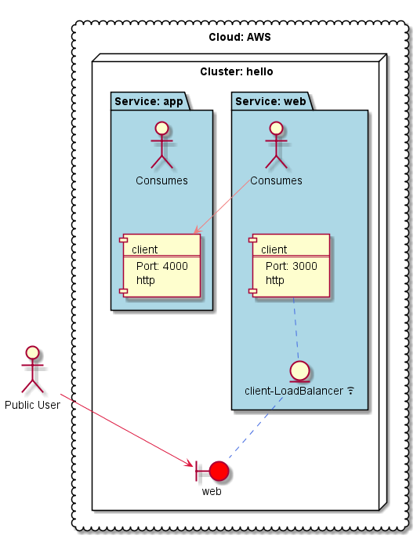

# Berlioz Hello World Samples

HelloWorld set of samples represent evolution of a most trivial single tier application to a multi-tier stateful services application. Start deployment from the v1 up to v5.

## [v1.basic](v1.basic)
Deploys a web application. The app renders some environment variables.

## [v2.second-service](v2.second-service)
Deploys two tier web-app application. Web service communicates with app service.

## [v3.load-balancer](v3.load-balancer)
Provisions a load-balancer in front of the web service.

## [v4.dns](v4.dns)
Registers a DNS record for web service and also provisions the second load-balancer in front of the app service.

## [v5.db](v5.db)
Deploys mysql and implements a simple contact list application.

