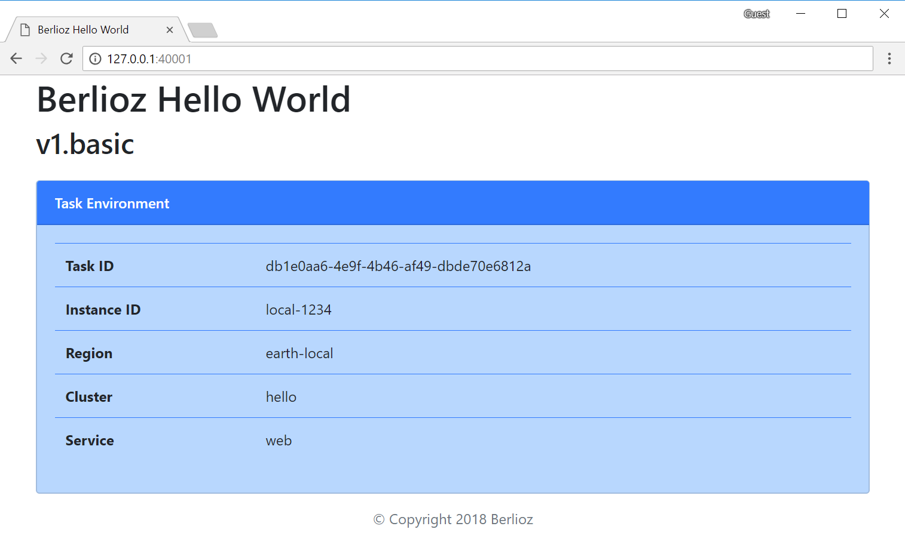

# Berlioz Hello World v1.basic

Initial version of Hello World application. Nothing fancy, just a single web
application. When deployed to local workstation should look somewhat like the
screenshot below. Environment variables would be different when deployed to
AWS.


## Running Locally

1. Navigate to sample directory
```
$ cd 01.HelloWorld/v1.basic
```

2. Build and deploy the project
```
$ berlioz local push-provision
```

3. Output service endpoint addresses
```
$ berlioz local endpoints
```

4. Once completed release AWS resources
```
$ berlioz local unprovision
```

## Deploying to AWS

1. Make sure that AWS account is linked and deployments were created. If not follow instructions [here](../../README.md).

2. Build and push the project to berlioz
```
$ berlioz push
```

3. Deploy the project to the test deployment
```
$ berlioz provision --deployment test --cluster dynamo --region us-east-1
```

4. Output service endpoint addresses
```
$ berlioz endpoints --deployment test
```

5. Once completed release AWS resources
```
$ berlioz unprovision --deployment test --cluster dynamo --region us-east-1
```

## Service Diagram
```
$ berlioz output-diagram
```

