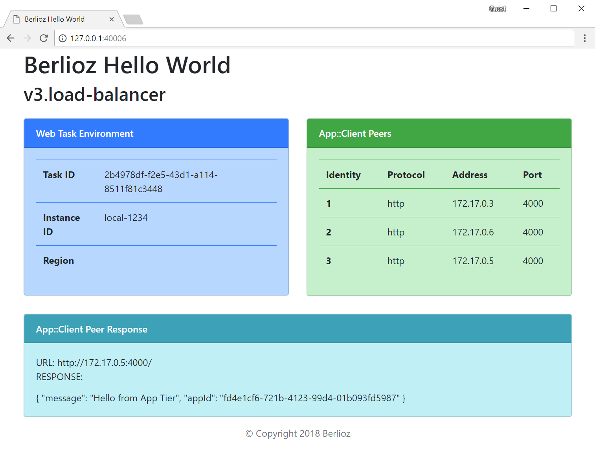
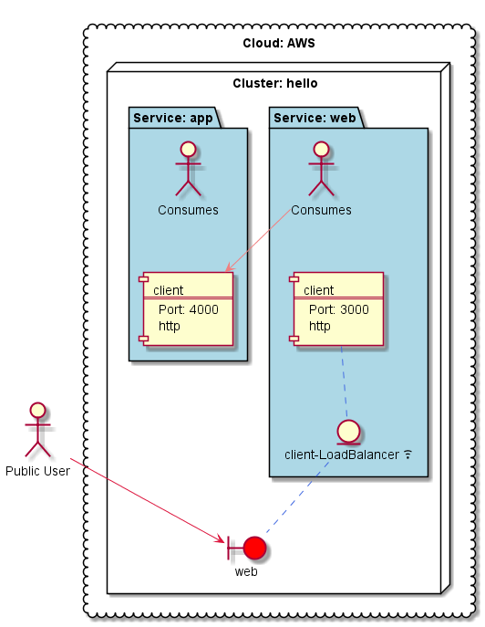

# Berlioz Hello World v3.load-balancer

Third version of Hello World application. Very similar to [second version](../v2.second-service), except we provisioned a http load balancer in front of the web service.



## Service Diagram
```
$ berlioz output-diagram
```


## Running Locally

1. Navigate to sample directory
```
$ cd 01.HelloWorld/v3.load-balancer
```

2. Build and deploy the project
```
$ berlioz local push-provision
```

3. Output service endpoint addresses
```
$ berlioz local endpoints
```

4. Change the number of **web** and **app** service instances running
```
$ berlioz local scale set --cluster hello --service web --value 2
$ berlioz local scale set --cluster hello --service app --value 3
```

5. Once completed release AWS resources
```
$ berlioz local unprovision
```

## Deploying to AWS

1. Make sure that AWS account is linked and deployments were created. If not follow instructions [here](../../README.md).

2. Build and push the project to berlioz
```
$ berlioz push
```

3. Deploy the project to the test deployment
```
$ berlioz provision --deployment test --cluster hello --region us-east-1
```

4. Change the number of **web** and **app** service instances running
```
$ berlioz scale set --deployment test --cluster hello --region us-east-1 --service web --value 2
$ berlioz scale set --deployment test --cluster hello --region us-east-1 --service app --value 3
```

5. Check the deployment status. Proceed forward once completed.
```
$ berlioz deployment status
```

6. Output service endpoint addresses. This time the output will only have one
endpoint which would be the AWS load balancer.
```
$ berlioz endpoints --deployment test
```

7. Once completed release AWS resources
```
$ berlioz unprovision --deployment test --cluster hello --region us-east-1
```


## Next Version
Navigate to [next version](../v4.dns) of HelloWorld sample were a public dns and the second load-balancer will be added.
