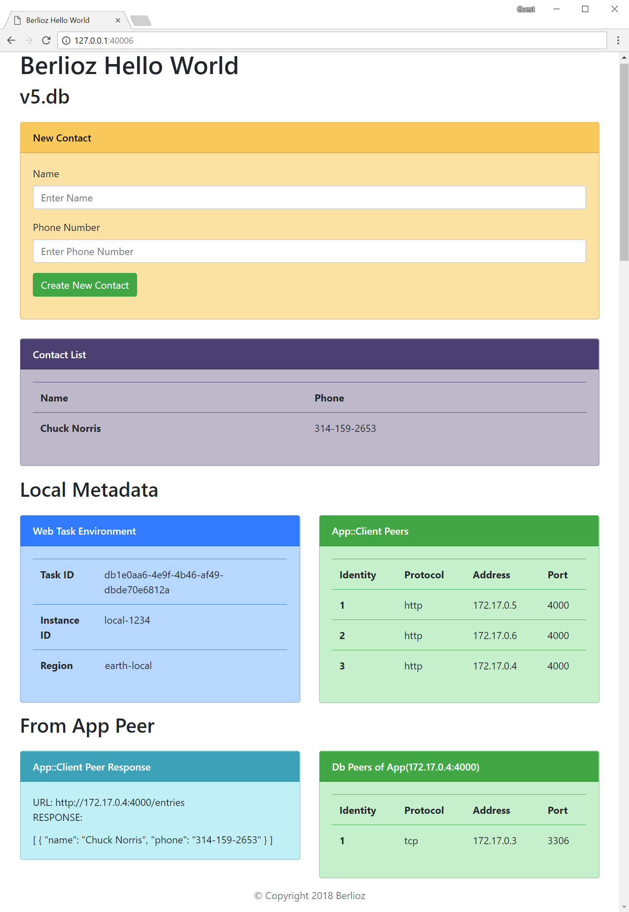
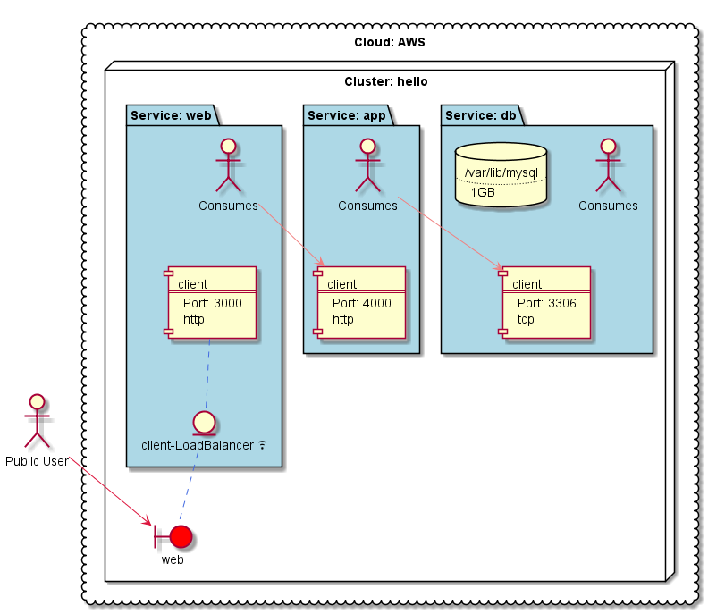

# Berlioz Hello World v5.db

Fifth version of Hello World application. Compared with the
[fourth version](../v4.dns) adding third service: self-hosted **mysql**
database. For the **db** service we defined that it would need a 1GB of storage and that storage should be mapped to _/var/lib/mysql_.

Also, we removed the load-balancer which was in front of the **app**
service. To make it more interesting we made a contact list application.

Please note that even though in this example there are three tiers: web, app and db, we by no means are promoting a monolithic application architectures.
With berlioz it is a trivial task to define
per-domain/per-feature app, db, etc services.
For more complex cases please checkout further samples.    

The screenshot below shows how the **web** and **app** endpoints discovered their peers.


## Service Diagram
```
$ berlioz output-diagram
```


## Running Locally

1. Navigate to sample directory
```
$ cd 01.HelloWorld/v5.db
```

2. Build and deploy the project
```
$ berlioz local push-run
```

3. Output service endpoint addresses
```
$ berlioz local endpoints
```

4. Change the number of **web** and **app** service instances running
```
$ berlioz local scale set --cluster hello --service web --value 2
$ berlioz local scale set --cluster hello --service app --value 3
```

5. Once completed release AWS resources
```
$ berlioz local stop
```

## Deploying to AWS

1. Make sure that AWS account is linked and deployments were created. If not follow instructions [here](../../README.md).

2. Build and push the project to berlioz
```
$ berlioz push
```

3. Deploy the project to the test deployment
```
$ berlioz run --deployment test --cluster hello --region us-east-1
```

4. Change the number of **web** and **app** service instances running
```
$ berlioz scale set --deployment test --cluster hello --region us-east-1 --service web --value 2
$ berlioz scale set --deployment test --cluster hello --region us-east-1 --service app --value 3
```

5. Check the deployment status. Proceed forward once completed.
```
$ berlioz status
```

6. Output service endpoint addresses.
```
$ berlioz endpoints --deployment test
```

7. Once completed release AWS resources
```
$ berlioz stop --deployment test --cluster hello --region us-east-1
```

## Next
This was the last change we planned for Hello World sample.
Now you're ready for more [advanced samples](../../02.DynamoDB) scenarios using AWS native services.
