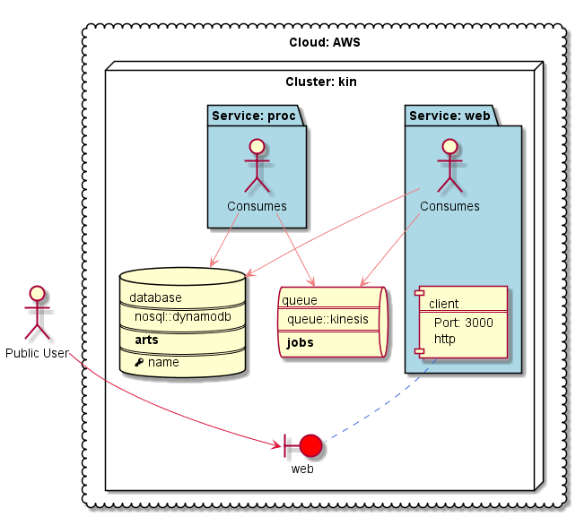

# Berlioz Kinesis Demo

An application which performs ASCII art rendering in a batch mode using AWS Kinesis and DynamoDB.



## Running Locally

1. Prerequisites. If you haven't already installed **berlioz** command line tools and set up AWS account profile, run:
```
$ npm install berlioz -g
$ berlioz local account --profile <the-name-of-aws-profile-to-use>
```

2. Navigate to sample directory
```
$ cd 03.Kinesis
```

3. Build and deploy the project
```
$ berlioz local build-run
```

4. Output service endpoint addresses
```
$ berlioz local endpoints
```

5. Once completed release AWS resources
```
$ berlioz local stop
```

## Deploying to AWS

1. Make sure that AWS account is linked and deployments were created. If not follow instructions [here](../README.md).

2. Login the region in order to push images
```
$ berlioz login --region us-east-1
```

3. Build and push the project to berlioz
```
$ berlioz push --region us-east-1
```

4. Deploy the project to the test deployment
```
$ berlioz run --deployment test --cluster kin --region us-east-1
```

5. Output service endpoint addresses
```
$ berlioz endpoints --deployment test --region us-east-1
```

6. Once completed release AWS resources
```
$ berlioz stop --deployment test --cluster kin --region us-east-1
```
