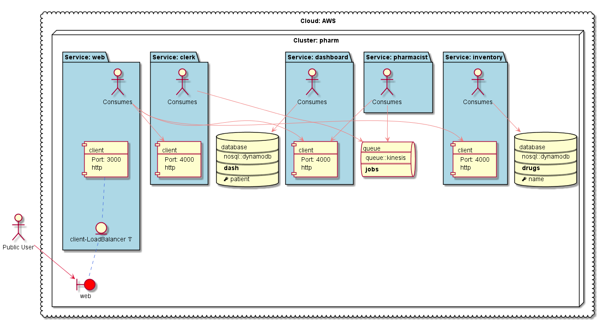

# Berlioz Samples
The purpose of this repository is to present capabilities of [Berlioz](https://berlioz.cloud) - the microservices applications deployment and orchestration service for AWS.

The repo is structured in chapters, starting with trivial samples to more complex applications.

## Prerequisites
First, install _berlioz_ command line toolkit.
```
$ npm install berlioz -g
```

## Running Samples Locally
1. Navigate to sample directory
```
$ cd 01.HelloWorld.js/v1.basic
```

2. Some examples are using AWS native resources like DynamoDB and Kinesis. In order to run the samples locally you should provide the name of AWS profile to use to provision thouse native resources:
```
$ berlioz local account --profile <the-name-of-aws-profile-to-use>
```

3. Build and deploy the project
```
$ berlioz local build-run
```

4. Output service endpoint addresses
```
$ berlioz local endpoints
```

5. Open the endpoint in the browser: http://localhost:40000 (use the port returned from the step 3).

## Running Samples in AWS

### Account Setup
1. Sign-up and login to AWS.
2. Create AWS access key. For details see the guide [here](docs/aws.md).
3. Sign-up to Berlioz:
```
$ berlioz signup
```
4. Link AWS account to Berlioz:
```
$ berlioz provider create --name myaws --kind aws --key <key> --secret <secret>
```
5. Create deployments for production and test:
```
$ berlioz deployment create --name prod --provider myaws
$ berlioz deployment create --name test --provider myaws
```

### Deploying the sample to AWS
1. Navigate to sample directory
```
$ cd 01.HelloWorld.js/v1.basic
```

2. Login the region in order to push images
```
$ berlioz login
```

3. Build and push the project to berlioz
```
$ berlioz push --region us-east-1
```

4. Deploy the project to the test deployment
```
$ berlioz run --deployment test --cluster hello --region us-east-1
```

5. Output service endpoint addresses
```
$ berlioz endpoints --deployment test --region us-east-1
```

6. Open the endpoint in the browser: http://1.2.3.4:12345 (use the address and port returned from the step 4).


## Service Diagrams
The berlioz comes with graphical diagram generation tool. To generate a diagram simply:

```
$ cd 02.DynamoDB
$ berlioz output-diagram
```

Will generate a diagram like this:


or for a more complex project:
```
$ cd 02.Pharmacy
$ berlioz output-diagram
```

